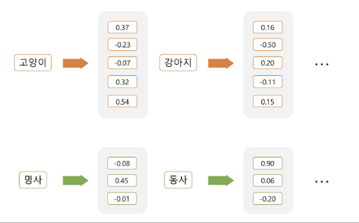

# Proj01_뉴스기사 자동 요약 프로그램

| <설계 순서>                                                                                |
|:--------------------------------------------------------------------------------------:|
| 1. 뉴스 기사 (base64 파일) 디코딩<br/>2. 문서 요약 / 키워드 추출<br/>3. 요약 리포트 작성<br/>4. html 파일로 Export |

---

### **바이너리 파일 (Binary file)**

- 바이너리 파일이란 ‘0’ 과 ‘1’ 을 이용한 **2진수 데이터** 만으로만으로 인코딩된 파일
- 사람이 직접 읽을 수 없다
- 데이터를 효율적으로 처리, 저장, 실행 등을 목적으로 만들어진 파일
- 장점
  - 데이터를 처리하고 전송하는데 일반적으로 비용이 적게 든다.
  - 텍스트 파일에 비해서 데이터 처리 속도가 빠르다.
  - 데이터 저장 공간도 적게 듦
- 대표적인 확장자 : exe, dll, zip, rar, mp3, mpg, jpg, png 등

### Base64 인코딩

- 다양한 통신채널 (HTML, 이메일 등) 을 통해 **바이너리 데이터**를 **안전하게 전송**할 수 있게 하는 방법
- ASCII, Unicode 인코딩과 함께 실생활에서도 많이 사용되는 인코딩 방법
- ASCII (8bit) 인코딩은 프로토콜,시스템마다 다르게 해석되어 데이터가 왜곡될 여지가 있기 때문에 적합하지 않음
- XML이나 HTTP 프로토콜에서도 특수문자 파싱 문제를 해결할 수 있는 수단
- 64 진법은 ASCII문자들을 모두 표현할 수 있는 가장 작은 진법
  - `문자열 입력` -> `ASCII/Binary (8bit)` -> `6bit cut` -> `base64`
- [Base64 인코딩 테이블](https://en.wikipedia.org/wiki/Base64)

### textwrap

- 파이썬에서 **문자열을 보기 좋은 형태**로 정렬 또는 줄바꿈하는데 사용할 수 있는 라이브러리

- 원하는 길이에 맞게 줄이기 : textwrap.shorten()
  
  - textwrap.shorten(text, width=100, placeholder='...[이하줄임]')

- 긴 문장 자르기 : textwrap.wrap() 
  
  - ex. wrapped_text = textwrap.wrap(text, width=40)

- 긴 문장 줄바꿈 : textwrap.fill()
  
  - filled_text = textwrap.fill(text, width=40)

### re

- `정규표현식(regular expressions)`은 복잡한 문자열을 처리할 때 사용하는 기법으로, 파이썬뿐 아니라 C, 자바, 심지어 문서 작성 프로그램 등 문자열을 처리해야 하는 다양한 곳에서 활용중

- 특정 문자열 `추출`, `변환` 등에 사용

- [공식문서](https://docs.python.org/3/library/re.html)

- 단어 추출: re.findall()
  
  - words = re.findall(r'\w+', text)

### collections.Counter

- collections.Counter는 리스트나 문자열과 같은 자료형의 요소 중 **값이 같은 요소가 몇 개인지를 확인**할 때 사용

- 빈도수 산출: Counter()
  
  - counter = collections.Counter(words)

- 상위 빈도수 단어 추출: most_common()
  
  - print(counter.most_common(5))

### gensim



- 자연어 처리, 토픽 모델링에 활발히 사용되는 파이썬 머신러닝 라이브러리[]

- **`Word2Vec`** 알고리즘을 통한 **자연어의 벡터화 (Word Embedding)** 이 대표적

- **`summarization`** 내장 모듈로 **긴 문장을 요약**할 수 있음 ( *gensim 4.x 버전 부터는 요약기능이 지원되지 않음 !* )

- import gensim 으로 불러옴
  
  ```python
  import gensim
  
  # 모델 불러오기
  model = gensim.models.Word2Vec.load('ko/ko.bin')
  
  model # <gensim.models.word2vec.Word2Vec at 0x243754f44c0>
  
  # 유사한 단어 검색
  model.wv.most_similar("뉴스")
  
  """
  [('리포트', 0.6553798317909241),
   ('언론사', 0.6399534940719604),
   ('앵커', 0.637794017791748),
   ('데일리', 0.6316319704055786),
   ('일간지', 0.6260204315185547),
   ('투데이', 0.623687744140625),
   ('토크쇼', 0.593853771686554),
   ('중앙일보', 0.5876286625862122),
   ('데스크', 0.5873064398765564),
   ('한겨레', 0.5844350457191467)]
  """
  
  # 유사도 검색
  model.wv.similarity('자동차', '강아지') # -0.019872822
  ```

### 문서 요약하기

```python
from gensim.summarization.summarizer import summarize
import pandas as pd
import numpy as np

# 데이터 불러오기
df = pd.read_csv('Book_test.csv')
df = df.iloc[0:100]
df.reset_index(inplace=True)

df.loc[0,'passage']
df.loc[0,'summary']

# 첫번째 데이터 요약
summarize(df.loc[0,'passage'])

# 첫번째 데이터 요약
summarize(df.loc[0,'passage'], ratio=0.4)

# 전체 데이터 적용
df['extract'] = df.passage.apply(lambda x : summarize(x, ratio=0.4)))

df.head()

# 시각화
for i in range(0,1):
    random_number = np.random.randint(0, 100, size=1)
    print("="*120)
    print(f'{random_number[0]}' + ' 번째 문장 \n')
    print('원문: \n\n' + df['passage'][random_number[0]] + '\n\n')
    print('AI 요약: \n\n' + df['summary'][random_number[0]] + '\n\n')
    print('Gensim 요약: \n\n'+ df['extract'][random_number[0]] + '\n\n')

"""
# 결과========================================================================================================================

원문: 

 불균등발전 문제를 해결하기 위해 중국 제 4세대 지도자들은 이전의 성장일변도 정책을 수정했다. 대신 ‘종합적이고 조화로우며 지속가능한 발전관’에 입각하여 ‘다섯 가지 균형’(오개통 주), 즉 ① 도시와 농촌, ② 연해지역과 내륙지역, ③ 경제와 사회, ④ 인간과 자연, ⑤ 국내와 대외개방의 균형발전을 이룩한다는 새로운 정책을 채택했다. 이점이 신지도부 정책의 중요한 특징이다. 신지도부는 사회보장제도의 완비에 더 많은 예산을 배정했고, 서부대개발에 이어 동북삼성 진흥정책을 새롭게 추진하고 있다. 환경보호와 자원절약에 더 많은 노력을 경주하는 것도 이런 정책의 일환이다.
 또한 중국 신지도부는 3농 문제 해결을 사회/경제 분야의 최우선과제로 설정해 추진한다. 우선 농촌 과잉노동력 해결정책으로 농민의 도시진출 장벽을 완화하기 위해 2000년 무렵부터 일부지역에서 시험 실시하던 호구제도 개혁을 전면적으로 확대하였다. 그 결과 베이징, 상하이, 광저우(광주), 선전(심천) 등 일부 대도시에서는 농민의 도시이주가 여전히 제한되지만 다른 일반도시의 경우는 안정된 직업, 일정기간(보통 2-3년)의 거주 등 조건만 충족되면 농민도 도시의 호구를 얻을 수 있게 되었다. 농민의 과도한 부담을 해결하기 위해 2000년부터 안후이성(안휘성)에서 실시되던 조세 일괄부과제도(세비제)가 다른 지역으로 확대 실시되었고, 이를 위해 중앙정부는 2003년에만 300억 위안(한화 약 4조 5천억 원)의 특별예산을 편성했다. 또한 농업 기반시설의 확충과 농촌저발전 문제를 해결하기 위해 중앙정부는 2003년에만 270억 위안(한화 약 4조 500억 원)을 배정했다. 여기에 더해 2006년부터는 그동안 일부지역에서 실시했던 농업에 전면감면을 전국적으로 확대하기로 결정했다.


AI 요약: 

 제 4세대 지도자들은 불균등발전 문제를 해결하기 위해 성장일변도 정책을 수정했다. 그리고 경제와 사회, 도시와 농촌 등의 균형발전을 이룩한다는 다섯 가지 균형 정책을 채택했다. 중국 신지도부는 3농 문제 해결을 최우선 과제로 설정해 추진했고, 2000년 무렵부터 호구제도 개혁을 전면적으로 확대해 조건만 충족된다면 농민도 도시 호구를 얻을 수 있게 됐다. 그리고 조세 일괄부과제도를 확대 실시하여 농민의 과도한 부담을 해결했다.


Gensim 요약: 

불균등발전 문제를 해결하기 위해 중국 제 4세대 지도자들은 이전의 성장일변도 정책을 수정했다.
우선 농촌 과잉노동력 해결정책으로 농민의 도시진출 장벽을 완화하기 위해 2000년 무렵부터 일부지역에서 시험 실시하던 호구제도 개혁을 전면적으로 확대하였다.
농민의 과도한 부담을 해결하기 위해 2000년부터 안후이성(안휘성)에서 실시되던 조세 일괄부과제도(세비제)가 다른 지역으로 확대 실시되었고, 이를 위해 중앙정부는 2003년에만 300억 위안(한화 약 4조 5천억 원)의 특별예산을 편성했다.
또한 농업 기반시설의 확충과 농촌저발전 문제를 해결하기 위해 중앙정부는 2003년에만 270억 위안(한화 약 4조 500억 원)을 배정했다.
"""
```
